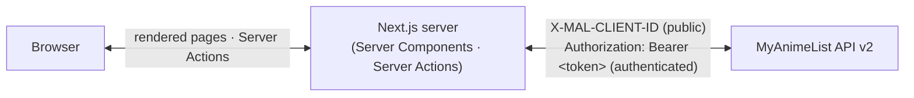

<div align="center">


Browse rankings, search, and manage your list — no separate backend, no exposed API, just Next.js talking to MAL directly from the server.

[](https://nextjs.org)
[](https://react.dev)
[](https://www.typescriptlang.org)
[](https://tailwindcss.com)
[](https://vitest.dev)
[](https://playwright.dev)
[](https://myanimelist.net/apiconfig/references/api/v2)

[Screenshots](#screenshots) · [Features](#features) · [Tech Stack](#tech-stack) · [Architecture](#architecture) · [Getting Started](#getting-started)

</div>

---

## Screenshots

<table>
<tr>
<td align="center" width="33%"><br /><sub>Home</sub></td>
<td align="center" width="33%"><br /><sub>Browse — Rankings</sub></td>
<td align="center" width="33%"><br /><sub>Browse — Search</sub></td>
</tr>
<tr>
<td align="center" width="33%"><br /><sub>Anime Detail</sub></td>
<td align="center" width="33%"><br /><sub>Seasonal Archive</sub></td>
<td align="center" width="33%"><br /><sub>Manga Rankings</sub></td>
</tr>
<tr>
<td align="center" width="33%"><br /><sub>My List</sub></td>
<td align="center" width="33%"><br /><sub>My List — Filters</sub></td>
</tr>
</table>

<details>
<summary><b>Desktop</b></summary>
<br />


<br /><br />


</details>

## Features

- 🏆 **Rankings** for anime and manga (airing, upcoming, top, popularity, favorites, and more) with tab filters and load-more pagination
- 🗓️ **Seasonal archive** — browse anime by year and season, like MyAnimeList's own archive
- 🔍 **Search** across anime and manga, built directly into Browse
- 📖 **Detail pages** with synopsis, info panel, related titles, and recommendations
- 🔐 **Real multi-user login** with MyAnimeList (OAuth2 + PKCE) — each visitor logs in with their own account, never a shared one
- ✅ **My Anime List / My Manga List** with inline status, score, and progress editing, plus a genre/rating/release-date filter modal and in-list search
- 👤 **Profile page** with account stats
- 🌗 **Light/dark theme**
- 📱 **Responsive design** — a bottom nav and full-screen profile sheet on mobile, an inline nav and dropdown menu on desktop

## Tech Stack

| Layer | Technology |
| --- | --- |
| Framework | [Next.js 16](https://nextjs.org) (App Router, Server Components, Server Actions, Turbopack) |
| Language | [TypeScript](https://www.typescriptlang.org) |
| UI | [React 19](https://react.dev), [Tailwind CSS v4](https://tailwindcss.com), [Radix UI](https://www.radix-ui.com), [shadcn](https://ui.shadcn.com) primitives, [lucide-react](https://lucide.dev) icons |
| Carousels | [embla-carousel](https://www.embla-carousel.com) |
| Data source | [MyAnimeList API v2](https://myanimelist.net/apiconfig/references/api/v2) — called directly from server-side code, no backend of its own |
| Auth | OAuth2 + PKCE against MAL, httpOnly session cookies, proactive token refresh in `proxy.ts` (Next.js middleware) |
| Unit tests | [Vitest](https://vitest.dev), [React Testing Library](https://testing-library.com/react) |
| E2E tests | [Playwright](https://playwright.dev) (desktop, mobile, and tablet viewports) against an in-memory mock of the MAL API |
| Tooling | [pnpm](https://pnpm.io), [ESLint](https://eslint.org) |

## Architecture

Everything runs inside this one app — there's no separate backend to run or deploy.



- `/auth/login` starts an OAuth2 + PKCE flow against MAL directly; `/auth/callback` exchanges the code for tokens and stores them in an httpOnly session cookie; `/auth/logout` clears it.
- `proxy.ts` (Next.js's Proxy/Middleware convention) proactively refreshes a near-expiry access token before it reaches a page render.
- `src/lib/api.ts` and `src/lib/actions.ts` call `https://api.myanimelist.net/v2` directly — public endpoints (search, ranking, season, detail without a caller) authenticate with the app's own `X-MAL-CLIENT-ID`; authenticated endpoints (lists, profile, mutations) forward the current visitor's own token via `Authorization: Bearer <token>`.
- Both files are `server-only` / `"use server"`, so none of this is reachable as a public HTTP endpoint — there's no `/api/anime`, `/api/users/@me`, etc. to curl. MAL calls only ever happen during SSR or inside a Server Action invoked by this app's own pages.

## Getting Started

1. Register an app on MyAnimeList (*Profile Settings → API*), type **"other"** (PKCE public client). Set the redirect URI to `http://localhost:3001/auth/callback`.
2. Configure this app's environment:
   ```bash
   cp .env.example .env.local
   # MAL_CLIENT_ID: from your MAL app registration
   ```
3. Install dependencies and start the dev server:
   ```bash
   pnpm install
   pnpm dev
   ```
4. Open [http://localhost:3001](http://localhost:3001) and log in with MyAnimeList from the nav bar.

## Scripts

| Script | Description |
| --- | --- |
| `pnpm dev` | Run the dev server on port 3001 |
| `pnpm build` | Production build |
| `pnpm start` | Run the production build (port 3001) |
| `pnpm typecheck` | Type-check with `tsc --noEmit` |
| `pnpm lint` | Lint with ESLint |
| `pnpm test` | Run unit tests once (Vitest) |
| `pnpm test:watch` | Run unit tests in watch mode |
| `pnpm test:coverage` | Run unit tests with coverage |
| `pnpm test:e2e` | Run the Playwright e2e suite |
| `pnpm test:e2e:ui` | Run the Playwright e2e suite in UI mode |

## Testing

- **Unit tests** ([Vitest](https://vitest.dev) + React Testing Library) live alongside source files as `*.test.ts(x)` under `src/`. They cover formatting helpers, components, and the API client (with `fetch` and the session module mocked).
- **E2E tests** ([Playwright](https://playwright.dev)) live in `e2e/`. `playwright.config.ts` boots an in-memory mock of the MyAnimeList API (`e2e/mock-server.mjs`, pointed at via `MAL_API_BASE_URL`) plus this app, run against a production build, so tests never touch a real MyAnimeList account. Tests run across desktop, mobile (Pixel 7), and tablet (iPad Mini) viewports. `e2e/auth-helpers.ts`'s `loginAs()` simulates a logged-in visitor by setting the session cookie directly, since driving the real MAL OAuth redirect isn't possible in automated e2e.

## Project Structure

```text
src/
├── app/            # App Router routes (anime, manga, archive, browse, mylist, profile, auth/*)
├── components/     # UI components (cards, grids, nav, list editors, account menu, ...)
├── lib/            # API client, Server Actions, MAL OAuth helpers, session, types, formatting
└── test/           # Vitest setup and mocks
src/proxy.ts        # Proactive session token refresh (Next.js "Proxy"/middleware convention)
e2e/                # Playwright specs, mock server, and auth test helpers
```

---

<div align="center">
<sub>Anime and manga data © <a href="https://myanimelist.net">MyAnimeList</a>. This project is an unofficial client and is not affiliated with MyAnimeList.</sub>
</div>
