<div align="center">

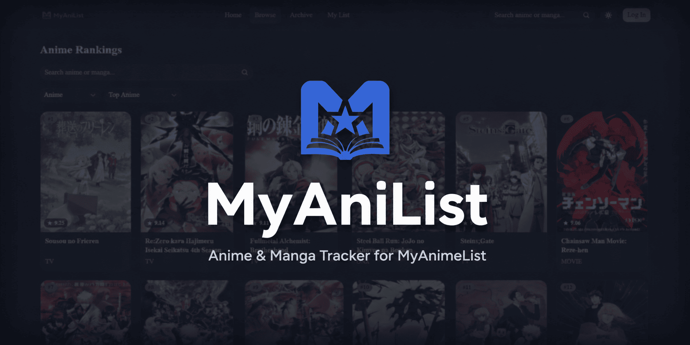

Browse rankings, search, and manage your list — no separate backend, no exposed API, just Next.js talking to MAL directly from the server.

[](https://nextjs.org)
[](https://react.dev)
[](https://www.typescriptlang.org)
[](https://tailwindcss.com)
[](https://vitest.dev)
[](https://playwright.dev)
[](https://myanimelist.net/apiconfig/references/api/v2)
[](https://myanilist.vercel.app/)

[Live Demo](https://myanilist.vercel.app/) · [Screenshots](#screenshots) · [Features](#features) · [Tech Stack](#tech-stack) · [Architecture](#architecture) · [Getting Started](#getting-started) · [Android App](#android-app-trusted-web-activity)

</div>

---

## Screenshots

<table>
<tr>
<td align="center" width="33%">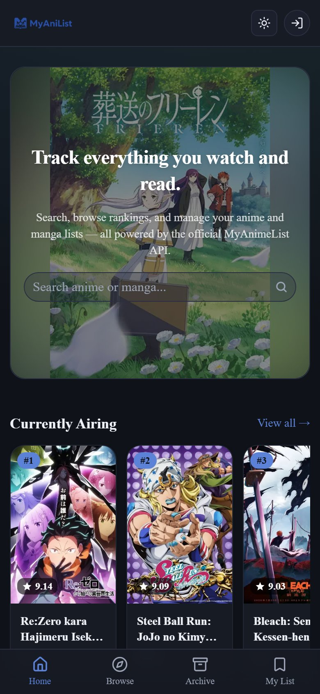<br /><sub>Home</sub></td>
<td align="center" width="33%">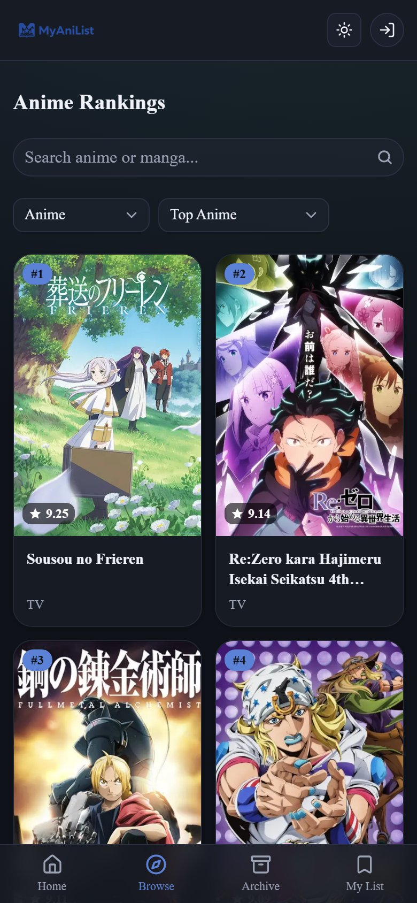<br /><sub>Browse — Rankings</sub></td>
<td align="center" width="33%">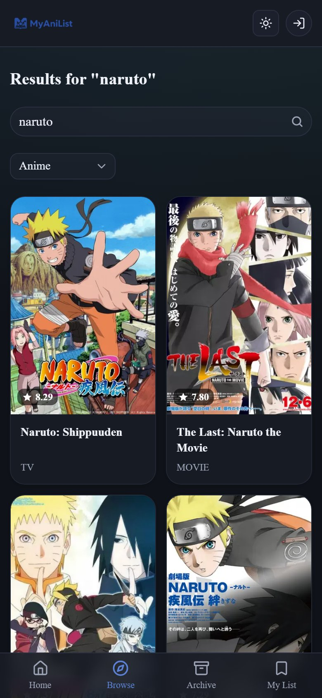<br /><sub>Browse — Search</sub></td>
</tr>
<tr>
<td align="center" width="33%">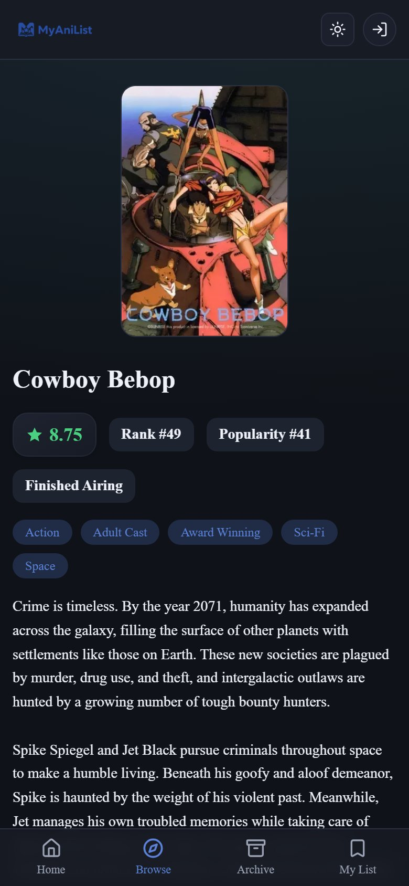<br /><sub>Anime Detail</sub></td>
<td align="center" width="33%">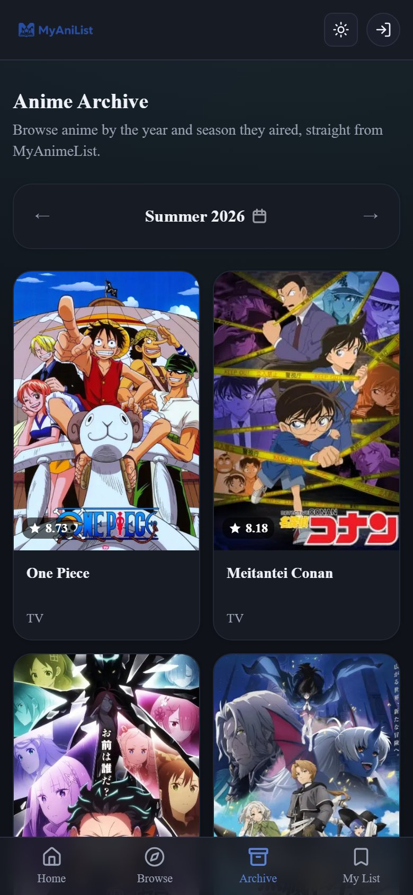<br /><sub>Seasonal Archive</sub></td>
<td align="center" width="33%">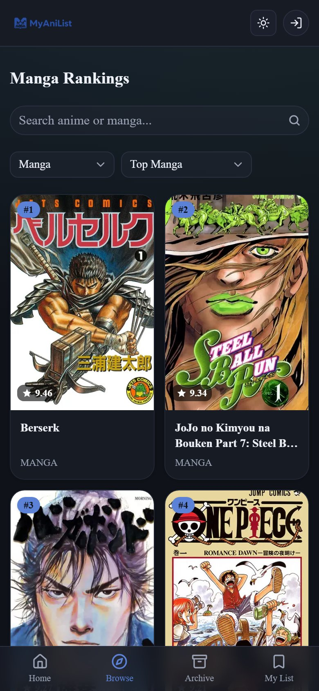<br /><sub>Manga Rankings</sub></td>
</tr>
<tr>
<td align="center" width="33%">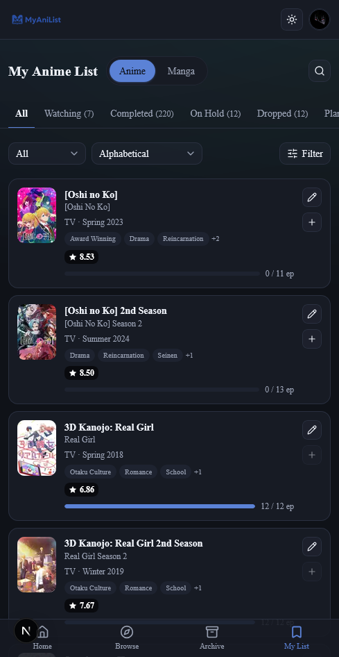<br /><sub>My List</sub></td>
<td align="center" width="33%">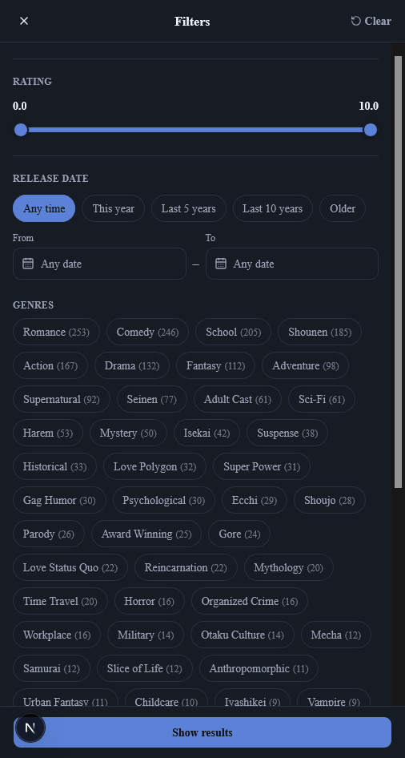<br /><sub>My List — Filters</sub></td>
</tr>
</table>

<details>
<summary><b>Desktop</b></summary>
<br />

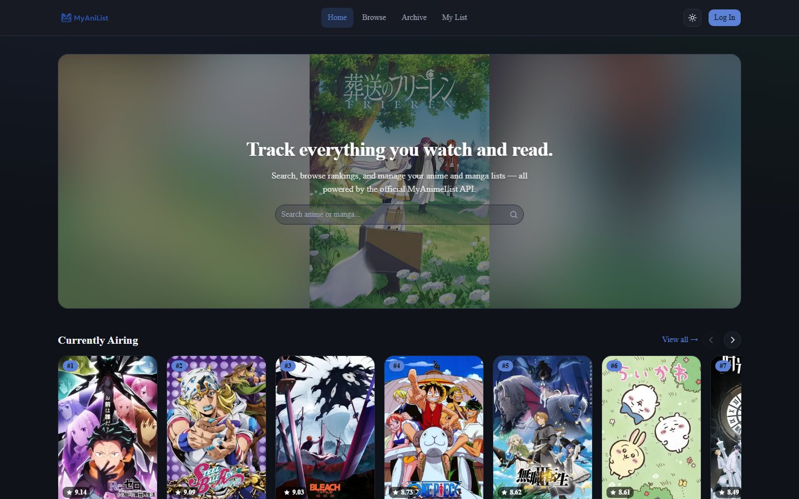
<br /><br />
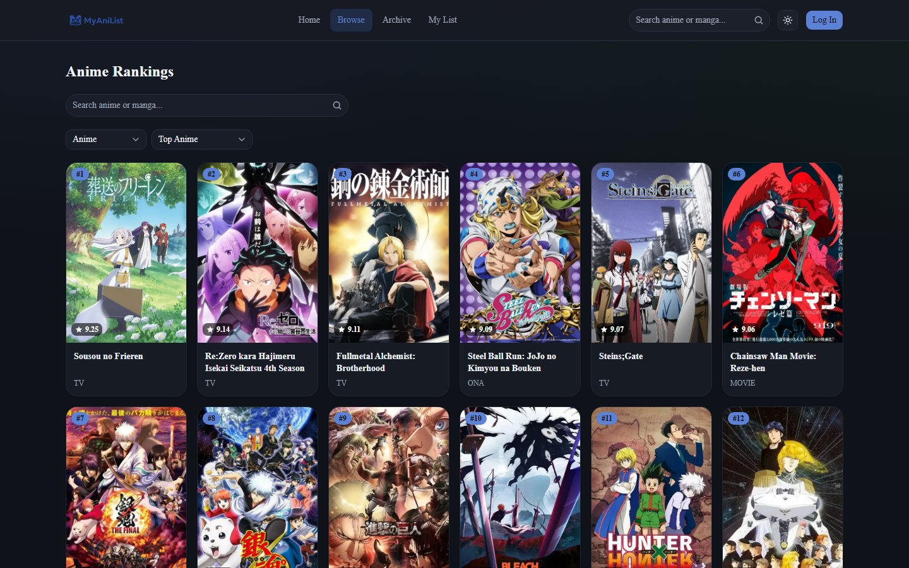

</details>

## Features

- 🏆 **Rankings** for anime and manga (airing, upcoming, top, popularity, favorites, and more) with tab filters and load-more pagination
- 🗓️ **Seasonal archive** — browse anime by year and season, like MyAnimeList's own archive
- 🔍 **Search** across anime and manga, built directly into Browse
- 📖 **Detail pages** with synopsis, info panel, related titles, and recommendations
- 🔐 **Real multi-user login** with MyAnimeList (OAuth2 + PKCE) — each visitor logs in with their own account, never a shared one
- ✅ **My Anime List / My Manga List** with inline status, score, and progress editing, plus a genre/rating/release-date filter modal and in-list search
- 👤 **Profile page** with account stats
- 🌗 **Light/dark theme**
- 📱 **Responsive design** — a bottom nav and full-screen profile sheet on mobile, an inline nav and dropdown menu on desktop

## Tech Stack

| Layer | Technology |
| --- | --- |
| Framework | [Next.js 16](https://nextjs.org) (App Router, Server Components, Server Actions, Turbopack) |
| Language | [TypeScript](https://www.typescriptlang.org) |
| UI | [React 19](https://react.dev), [Tailwind CSS v4](https://tailwindcss.com), [Radix UI](https://www.radix-ui.com), [shadcn](https://ui.shadcn.com) primitives, [lucide-react](https://lucide.dev) icons |
| Carousels | [embla-carousel](https://www.embla-carousel.com) |
| Data source | [MyAnimeList API v2](https://myanimelist.net/apiconfig/references/api/v2) — called directly from server-side code, no backend of its own |
| Auth | OAuth2 + PKCE against MAL, httpOnly session cookies, proactive token refresh in `proxy.ts` (Next.js middleware) |
| Unit tests | [Vitest](https://vitest.dev), [React Testing Library](https://testing-library.com/react) |
| E2E tests | [Playwright](https://playwright.dev) (desktop, mobile, and tablet viewports) against an in-memory mock of the MAL API |
| Tooling | [pnpm](https://pnpm.io), [ESLint](https://eslint.org) |

## Architecture

Everything runs inside this one app — there's no separate backend to run or deploy.

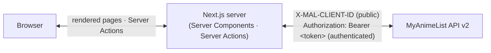

- `/auth/login` starts an OAuth2 + PKCE flow against MAL directly; `/auth/callback` exchanges the code for tokens and stores them in an httpOnly session cookie; `logoutAction` (a Server Action, not a GET route — GET routes get silently hit by Next.js's automatic `<Link>` prefetching) clears it.
- `proxy.ts` (Next.js's Proxy/Middleware convention) proactively refreshes a near-expiry access token before it reaches a page render.
- `src/lib/api.ts` and `src/lib/actions.ts` call `https://api.myanimelist.net/v2` directly — public endpoints (search, ranking, season, detail without a caller) authenticate with the app's own `X-MAL-CLIENT-ID`; authenticated endpoints (lists, profile, mutations) forward the current visitor's own token via `Authorization: Bearer <token>`.
- Both files are `server-only` / `"use server"`, so none of this is reachable as a public HTTP endpoint — there's no `/api/anime`, `/api/users/@me`, etc. to curl. MAL calls only ever happen during SSR or inside a Server Action invoked by this app's own pages.

## Getting Started

1. Register an app on MyAnimeList (*Profile Settings → API*), type **"other"** (PKCE public client). Set the redirect URI to `http://localhost:3001/auth/callback`.
2. Configure this app's environment:
   ```bash
   cp .env.example .env.local
   # MAL_CLIENT_ID: from your MAL app registration
   ```
3. Install dependencies and start the dev server:
   ```bash
   pnpm install
   pnpm dev
   ```
4. Open [http://localhost:3001](http://localhost:3001) and log in with MyAnimeList from the nav bar.

## Scripts

| Script | Description |
| --- | --- |
| `pnpm dev` | Run the dev server on port 3001 |
| `pnpm build` | Production build |
| `pnpm start` | Run the production build (port 3001) |
| `pnpm typecheck` | Type-check with `tsc --noEmit` |
| `pnpm lint` | Lint with ESLint |
| `pnpm test` | Run unit tests once (Vitest) |
| `pnpm test:watch` | Run unit tests in watch mode |
| `pnpm test:coverage` | Run unit tests with coverage |
| `pnpm test:e2e` | Run the Playwright e2e suite |
| `pnpm test:e2e:ui` | Run the Playwright e2e suite in UI mode |
| `pnpm generate:icons` | Regenerate `public/icons/*` and `android/`'s launcher/splash images from `public/logo.webp` |

## Testing

- **Unit tests** ([Vitest](https://vitest.dev) + React Testing Library) live alongside source files as `*.test.ts(x)` under `src/`. They cover formatting helpers, components, and the API client (with `fetch` and the session module mocked).
- **E2E tests** ([Playwright](https://playwright.dev)) live in `e2e/`. `playwright.config.ts` boots an in-memory mock of the MyAnimeList API (`e2e/mock-server.mjs`, pointed at via `MAL_API_BASE_URL`) plus this app, run against a production build, so tests never touch a real MyAnimeList account. Tests run across desktop, mobile (Pixel 7), and tablet (iPad Mini) viewports. `e2e/auth-helpers.ts`'s `loginAs()` simulates a logged-in visitor by setting the session cookie directly, since driving the real MAL OAuth redirect isn't possible in automated e2e.

## Project Structure

```text
src/
├── app/            # App Router routes (anime, manga, archive, browse, mylist, profile, auth/*)
│   └── manifest.ts # PWA manifest (served at /manifest.webmanifest)
├── components/     # UI components (cards, grids, nav, list editors, account menu, ...)
├── lib/            # API client, Server Actions, MAL OAuth helpers, session, types, formatting
└── test/           # Vitest setup and mocks
src/proxy.ts        # Proactive session token refresh (Next.js "Proxy"/middleware convention)
e2e/                # Playwright specs, mock server, and auth test helpers
public/icons/       # Generated PWA icons (see `pnpm generate:icons`)
public/.well-known/assetlinks.json  # Digital Asset Links — see "Android App" below
scripts/generate-pwa-icons.mjs      # Generates public/icons/* and android/'s icon/splash images
android/            # Trusted Web Activity (TWA) project — wraps the live site for Google Play
```

## Android App (Trusted Web Activity)

MyAniList ships as a real Android app via a [Trusted Web Activity](https://developer.chrome.com/docs/android/trusted-web-activity/) (TWA) — Chrome renders the actual production site (`https://myanilist.vercel.app/`) full-screen inside a thin native wrapper (`android/`, using [`androidbrowserhelper`](https://github.com/GoogleChrome/android-browser-helper)). It is **not** a WebView wrapper and does **not** bundle a copy of the app — the Android project has no business logic of its own, so the site keeps working (and updating) exactly as it does in a browser.

### A. Required tools

- **JDK 17+** (JDK 21 works) to run Gradle.
- **Android SDK** — easiest via [Android Studio](https://developer.android.com/studio) (open `android/` as a project and it will offer to install missing SDK components), or the standalone [command-line tools](https://developer.android.com/tools/releases/cmdline-tools) + `sdkmanager` if you'd rather not install the full IDE.
- Optionally, the [Bubblewrap CLI](https://github.com/GoogleChromeLabs/bubblewrap) (`npm i -g @bubblewrap/cli`) if you'd rather regenerate/update the Android project from `android/twa-manifest.json` than hand-edit Gradle files.

### B. Package / application ID

- Package ID: **`to.myanilist.app`** (set in `android/app/build.gradle`'s `namespace`/`applicationId`, `android/twa-manifest.json`, and `public/.well-known/assetlinks.json`). Keep all three in sync if you ever change it.
- App name: **MyAniList** (`android/app/src/main/res/values/strings.xml`).

### C. Create the release signing key

Play Store releases must be signed with a real release key you generate and keep — never a debug key, and never one I invent for you:

```bash
keytool -genkeypair -v -storetype PKCS12 \
  -keystore android/release.jks \
  -alias myanilist \
  -keyalg RSA -keysize 2048 -validity 10000
```

You'll be prompted for a store password, a key password, and your identity details — pick a strong password and **store it somewhere safe** (a password manager). Losing this file or its password means you can never publish an update to the same Play Store listing again.

### D. Get the SHA-256 fingerprint

```bash
keytool -list -v -keystore android/release.jks -alias myanilist
```

Copy the `SHA256:` fingerprint from the output. If you enable [Play App Signing](https://support.google.com/googleplay/android-developer/answer/9842756) (recommended — Google re-signs your upload with its own key for distribution), use the **App signing certificate**'s SHA-256 from Play Console's *Setup → App signing* page instead, once your first upload has been processed there.

### E. Where the fingerprint goes

1. `public/.well-known/assetlinks.json` — replace `REPLACE_WITH_YOUR_SHA256_FINGERPRINT` in `sha256_cert_fingerprints`.
2. `android/twa-manifest.json`'s `fingerprints[0].value` (only used if you later run Bubblewrap; not read by Gradle).

### F. Local keystore config (never committed)

```bash
cp android/keystore.properties.example android/keystore.properties
# then edit android/keystore.properties with your real storeFile/storePassword/keyAlias/keyPassword
```

`android/keystore.properties`, `*.jks`, and `*.keystore` are gitignored (both in `android/.gitignore` and the root `.gitignore`). `android/app/build.gradle`'s release `signingConfig` reads from this file and **refuses to produce a release build without it** — it will never silently fall back to debug signing.

### G. Configure `assetlinks.json`

Already scaffolded at `public/.well-known/assetlinks.json` with the correct package name — you only need to swap in the real fingerprint (step E). This file is what Android fetches over HTTPS to verify the app ↔ site relationship (Digital Asset Links); `android/app/src/main/AndroidManifest.xml`'s `asset_statements` meta-data is the app's side of the same statement.

### H. Deploy `assetlinks.json`

It's a normal static file under `public/`, so it ships automatically with every deploy — no extra Vercel configuration needed. After deploying, confirm:

```bash
curl -i https://myanilist.vercel.app/.well-known/assetlinks.json
curl -i https://myanilist.vercel.app/manifest.webmanifest
```

Both should return `200` (verified locally against a production build — `pnpm build && pnpm start` — before this was ever pushed).

### I. Test the TWA locally

1. Deploy your changes (asset links verification fetches the *live* URL — it won't work against `localhost`).
2. Build and install a debug APK on a device or emulator:
   ```bash
   cd android
   ./gradlew installDebug
   ```
3. Confirm Digital Asset Links verification passed: `adb shell dumpsys package to.myanilist.app | grep -A5 "Domain verification"`, or visit `chrome://internal/webapp-verification` in Chrome on the device. If verification fails, the TWA falls back to a Chrome Custom Tab (with a visible URL bar) instead of failing silently — see `FALLBACK_STRATEGY` in `AndroidManifest.xml`.
4. Bubblewrap also has a built-in check if you have it installed: `bubblewrap validate` (run from `android/`, with `twa-manifest.json` present).

### J. Generate the production `.aab`

```bash
cd android
./gradlew bundleRelease
```

Output: `android/app/build/outputs/bundle/release/app-release.aab`. Requires `android/keystore.properties` to exist (step F) — the build fails with a clear error otherwise.

### K. Upload to Google Play Console

1. [Create an app](https://play.google.com/console) if you haven't already, using the same package ID (`to.myanilist.app`).
2. *Release → Production* (or a testing track first) → **Create new release** → upload `app-release.aab`.
3. Enable **Play App Signing** when prompted (recommended).
4. Fill in the store listing — you'll need a **512×512 icon** (`android/store-icon-512.png`, generated by `pnpm generate:icons`), a **1024×500 feature graphic**, and **phone screenshots** (not generated here — capture these from a device/emulator; they're marketing assets, out of scope for this change).
5. Complete the content rating questionnaire, privacy policy URL, and data safety form, then submit for review.
6. For future updates: bump `versionCode`/`versionName` in `android/app/build.gradle`, rebuild the `.aab`, and upload a new release — the signing key must be the same one from step C every time.

### L. Never commit

- `android/release.jks` / any `*.jks` or `*.keystore` file
- `android/keystore.properties` (store passwords, key alias/password)
- Any `MAL_CLIENT_ID` secrets, OAuth secrets, or `.env*` files beyond `.env.example`
- Firebase or other third-party credentials, if added later

All of the above are already covered by `.gitignore` / `android/.gitignore` — this list is a reminder, not a promise those files don't exist locally.

### What's already handled

- **Splash screen** matches system light/dark mode with no white flash: the manifest's `background_color`/`theme_color` and the native Android splash (`values/colors.xml` + `values-night/colors.xml`, referenced from `AndroidManifest.xml`'s `SPLASH_SCREEN_BACKGROUND_COLOR`/`SPLASH_IMAGE_DRAWABLE` meta-data) both resolve to `#0f1218` in dark and `#ffffff` in light, matching the site's own theme (`src/app/globals.css`). The Activity's own theme (`Theme.Launcher` in `values/styles.xml`) sets `windowBackground` to the same color, so even the very first frame Android paints — before any library code runs — is correct.
- **Back navigation, internal/external links, video** — all default Chrome/TWA behavior, unchanged: back navigates through the site's own history before exiting the app; the existing `target="_blank"` links (e.g. the MyAnimeList link on anime detail pages, streaming provider links on `/anime/[id]/watch`) already escape the verified origin into a normal browser tab; the trailer's YouTube iframe and its fullscreen/orientation handling are Chrome's, not the wrapper's.
- **Auth, cookies, storage** — untouched. OAuth (MAL) redirects work the same as in a normal browser tab since the TWA *is* Chrome for the verified origin.
- **Offline** — `public/sw.js` is a minimal service worker that only intercepts failed navigation requests and serves a static, theme-matched `public/offline.html`; it does not cache API responses, auth pages, or any user data.

---

<div align="center">
<sub>Anime and manga data © <a href="https://myanimelist.net">MyAnimeList</a>. This project is an unofficial client and is not affiliated with MyAnimeList.</sub>
</div>
